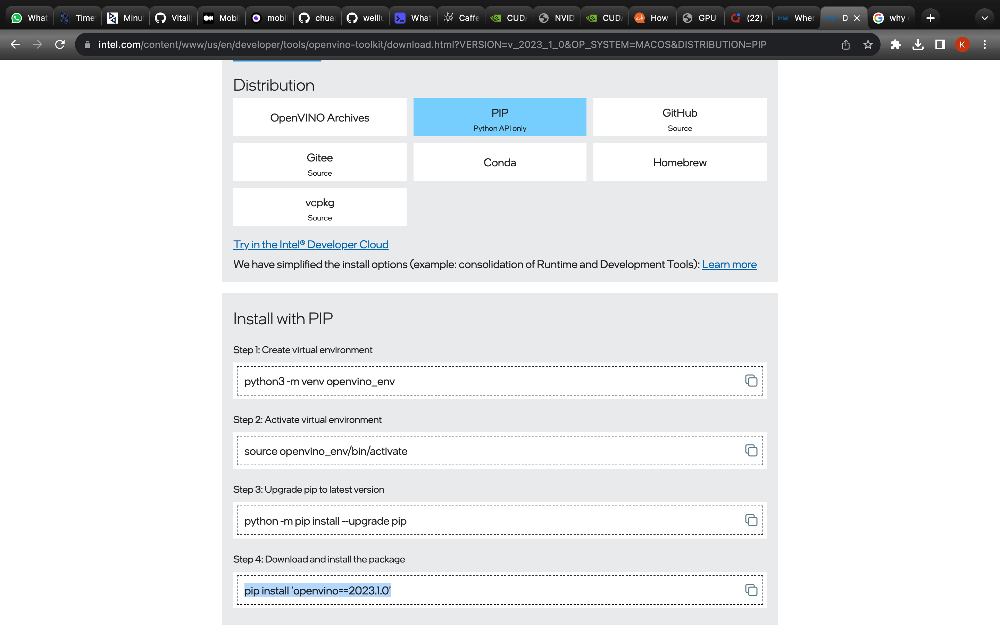
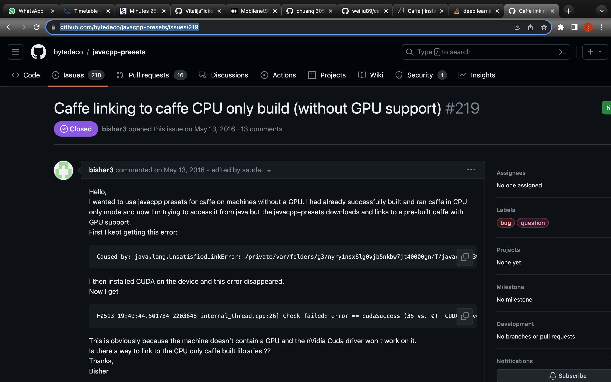
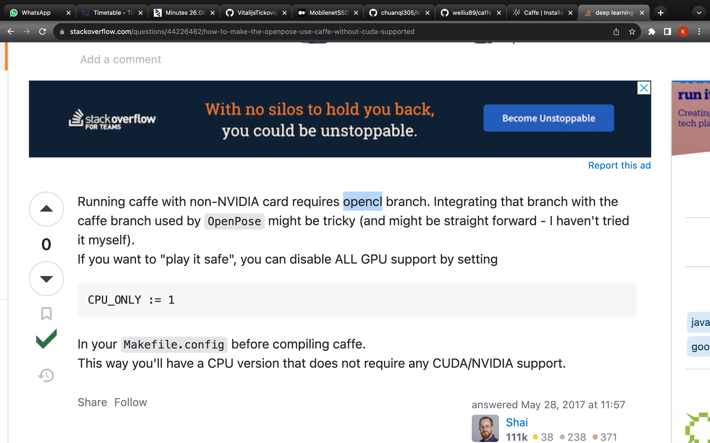
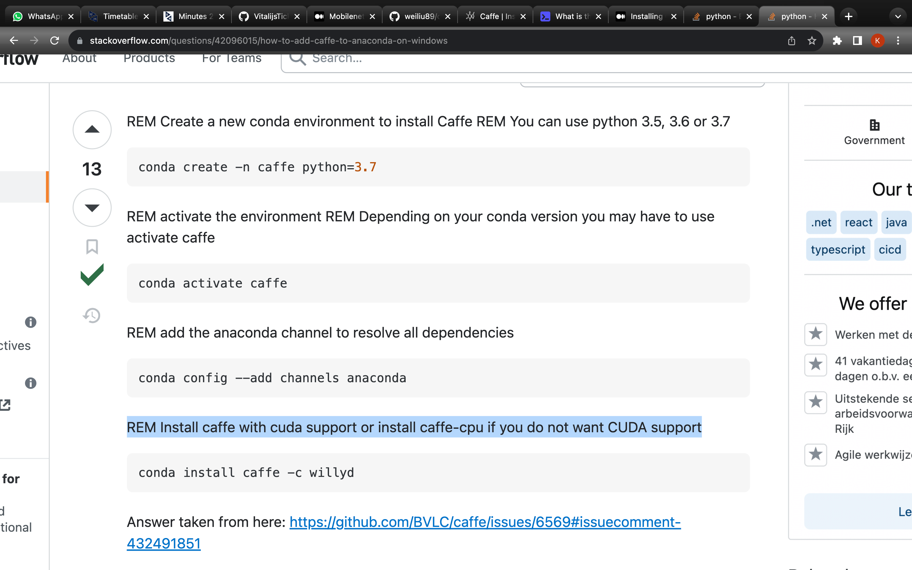
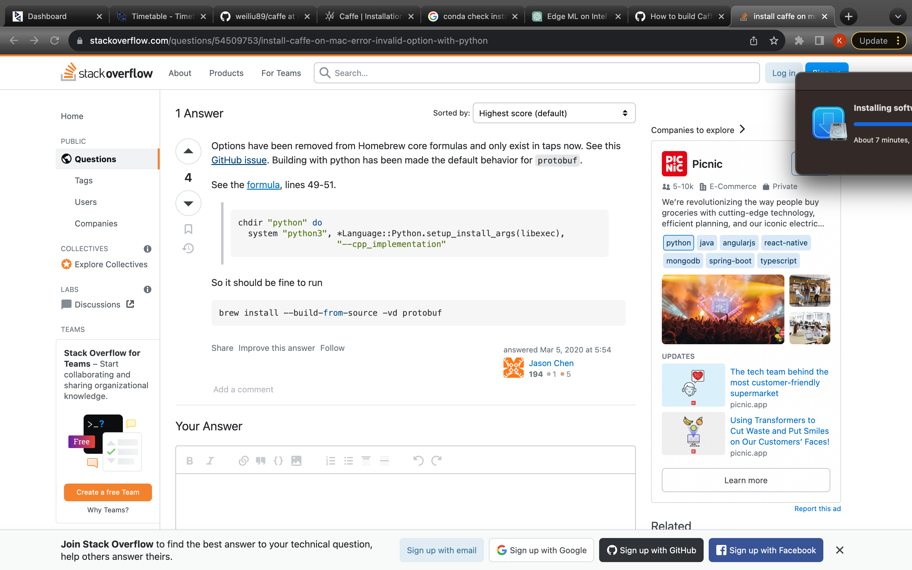
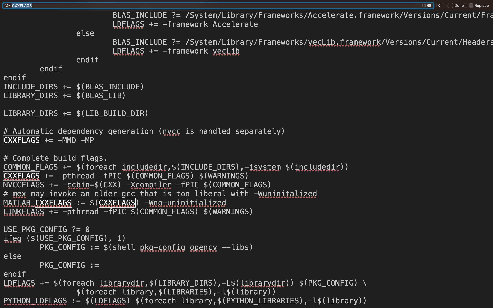
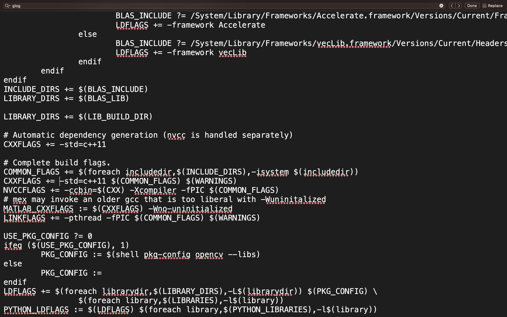
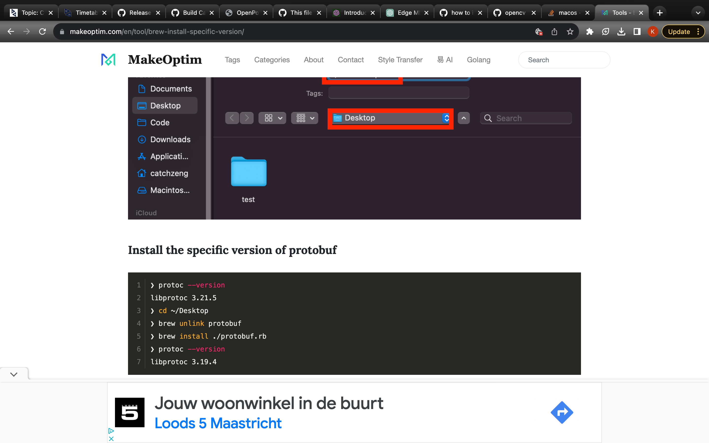

# 26 Septembre (2023):
## History:
- Created separate branch
- Created separate virtual enviornment
- Downloaded openVino
    - 
    - 

- Found out that openVino is only for inference (i.e. running, but not training)
    - (https://www.youtube.com/watch?v=kY9nZbX1DWM)
    - Hence useful for running the model given a certain file of weights, but not for training

- Found out that I can run Caffe based models without GPU SUPPORT (hence without CUDA). 
    - https://github.com/bytedeco/javacpp-presets/issues/219
    - 
    - 
    - 

- Starting to follow the instructions to download the MobilenetSSD model (https://github.com/chuanqi305/MobileNet-SSD)
    - I will need to request access to the weights
    - Installed SSD repository 
    - Stuck on installing Caffe
        - Looks like I caqn try to install it with anaconda? I don't wanna use brew. 
        - I am not sure whether it will cause any issues because it differs from standard installation, but I will just have to try.
            - 
            - According to digital assitant I might not be able to modify files as I want (e.g. enable only CPU) so it recommends downloading from source

## Ideas:
- Get a pre-trained model for showcasing purposes then start building upon it in phase 2
    - Need to start exploring it and looking at its source code in phase 1 so I could get 
        straight to work and enchancements in phase 2

## Closest goals/ views:
- download pre-trained model and set-it up to work on my mac -> see how good is it

# 1 Octobre (2023):
## History
1. Tried to install Caffe via anaconda only to find out that there is no package avilable for osx system. Try linux? 
2. Decided not to try linux version
3. Trying to install via official instructions and homebrew
    - let hdf5 be on anaconda python
    - installed all required brew libraries except for szip (couldn't find it on brew, assume part of anacondas hdf5)
    - installed command line tools xcode
    - installed 2 additional libraries:
        - command "--with-python" became obsolete now it is in python by default
        - 
        - No boost-python available only boost-python3
    - do the checks using otool from https://gist.github.com/kylemcdonald/0698c7749e483cd43a0e 
    - go to caffe makefile.config and modify it to use CPU and anaconda3 path
4. Tried to "make all". Ran into errors with C++ version of protoc. Possibly because of conflicting anaconda and brew? (https://github.com/BVLC/caffe/issues/6527)
5. Tried to ignore brew and go via anaconda:
    - change the PATH and CPATH variables to anaconda base bin and include directories
    - Also changed the protoc version headers to C++11 
        - 
        - 
    - had to instal glog 
    - had to install opencv
6. I next error occurs then I am
7. To many conflicts and too slow via conda installation so going back to brew

## Useful sources:
- Another caffe installation guide (https://gist.github.com/kylemcdonald/0698c7749e483cd43a0e)

## Objectives:
- Try to get back to brew and exclude conda
    - change PATH and CPATH variables to brew bin and brew include?
    - change back the flags to normal?
    - install python-boost3?

# 2 Octobre (2023)
## History:
1. Trying to comeback to brew
    - bin is folder with all the binary executables allowing to execute certain commands and programs on computer
    - brew install binaries to local bin direcotries on computer
    - there are multiple bin directories on computer
    - to see them in finder press: cmd + shift + .
2. How to change $PATH variable:
    - https://stackoverflow.com/questions/15872666/how-to-remove-entry-from-path-on-mac
3. Change the CXXFLAGS in makefile to -std=c++14
4. Conclusions:
    - the repository is written in old c++ version
    - potetntially need to downgrade all the brew packages especially protobuf
5. Was able to resolve error by removing the anaconda protoc and protobuf 
    - anaconda was conflicting with brew when runnign "make all"
    - 
6. Uninstalled opencv and protobuff in preparation for installing the downgraded versions
7. Installed protobuf@3 via brew which is more suitable for the release of the caffe repository
    - NOW I HAVE ONE ERROR LESS!!!
8. Problem is that now I am missing opencv2 while current opencv is v4 and overrieds my protobuf@3 with newer protobuf version
9. Tired to use opencv with protobuf and protobuf@3
    - unlinked protobuf and linked protobuf@3 so no protoc errors
    - still doesn't like opencv -> i.e. requests opencv2
10. Tired to install opencv2 via brew by editing .rb file but failed because of sha1 being depreciated (https://docs.brew.sh/Checksum_Deprecation)
    -  thanks to this guy for explanations 

## Objectives:
- Reinstall and downgrade protobuf version??? -> done, using protobuf@3 and it is working
- manually try to add opencv@2?

# 3 Octobre (2023)
1. Moved displicate opencv2 to include file of opencv version in brew
    - didn't work, same error
2. Manually unlinked opencv and linked manualyl downaloded opencv@2
     - didn't work
3. Coming back to 1.: I unlinked and relinked opencv and it know gives a different error which is further down the line (Wohoo!)
4. Trying to deal with openblas not being found. Tried to add two flags to the compiler (temporary i.e. only for this session ofterminal).
    - didn't work
5. I will try to link without unlinking anything
    - nope same error
6. Tried making a symbolic link manually to the openblas because right now it is nott linked to usr/local because of Appleds Accelerate.framework (https://stackoverflow.com/questions/57610663/linking-brew-installed-openblas-to-usr-local)
    - Didn't work 
7. Tried to change the makefile.config based on (https://github.com/CMU-Perceptual-Computing-Lab/openpose/issues/1942)
    - didn't work (not the same file strucutre)
    - maybe I can readapt it if I copy openblas from cellar and put it somewhere else
8. Tried writing in terminal: "export PATH="/usr/local/opt/openblas/include:$PATH"
    - didn't work
9. tried changing local bash_profile (https://stackoverflow.com/questions/30461201/how-do-i-edit-path-bash-profile-on-os-x)
    - Never do pbpaste > ~/.bash_profile if it already has information!!!
    - Accidentally overwrote my entire bashrc so I will need to reinstall the repository
10. Recreated caffe repository:
    - looks like "-std=c++11" were quiet important (otherwise doesn't compile)
    - changed makefile.config to use blas path from mac (https://gist.github.com/rizky/5c0f7435ce7d3bcd3e236cca99042587 and https://stackoverflow.com/questions/58279278/what-is-the-include-path-for-cblas-h-on-mac-os-x)
    - could have used opencv3 because there was an option makefile.config, but oh well (too late)
    - Quiet big progress, but another fucking error!
11. Looks like an opencv problem. Try to unlink opencv and use opencv@3?
    - downloaded opencv@3
    - unlinked opencv, linked opencv@3
    - unlinked protobuf@21
    - edited makefile.config to use opencv@3
    - solved!!!
12. Looks like I have again protobuf problem (specifically compatability)
    - see https://github.com/onnx/onnx/issues/2678
    - Looks like I need to downgrade even further if possible 
13. Trying to install an additonal brew repository to look for more protobuf versions
    - https://stackoverflow.com/questions/21775151/installing-google-protocol-buffers-on-mac
    - too many problems, maybe try anaconda donwload?
14. Figured out that when I killed my entire bash_profile I made it impossiblr for anaconda to run
    - thanksfully I figured out that there is .bash_profile.pysave file which saved the previous version of bash_profile 
    - source: https://stackoverflow.com/questions/38021598/what-exactly-is-bash-profile-pysave
15. Tried pip install of downgraded protobuf
    - failed to find a way to connect it 
16. Tried donwloading files from github and just replacing them manually (i.e. insert files from v 3.6.0 instead of the contained files of v 3.20.3)
    - downloaded two file types:
        - osx -> need to get the bin file of protoc 
        - src -> contains the files in the "include" directory 
        - result: gives errors of missing files instead 
17. STOPPING THIS NIGHTMARE
